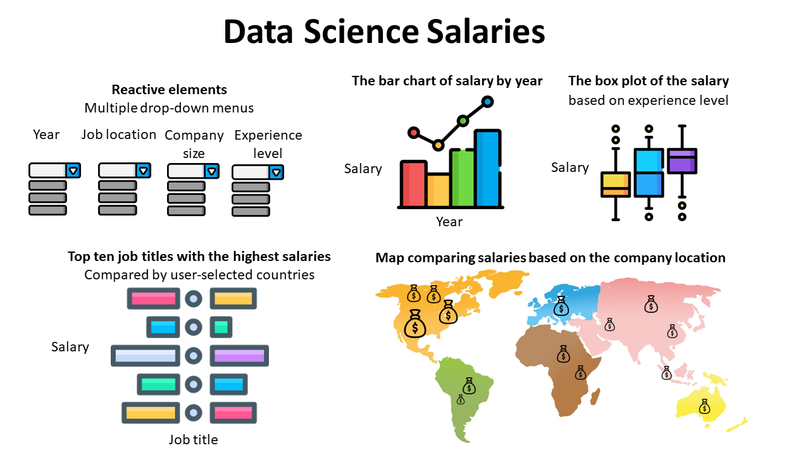

# DS-Salaries

- authors: Mehwish Nabi, Yaou Hu, Jonah Hamilton, Ruslan Dimitrov

## Motivation and research questions
Target audience: Our main target audience includes individuals searching for employment in the Data Science space. A secondary audience includes managers, recruiters, and founders looking to build a talented Data Science team.

The main research questions addressed by DS-Salaries are:

- How have salary levels changed over the past couple of years?
- What is the association between salary levels and experience?
- What are the top paying positions in the field of Data Science?
- How do salary levels for Data Science professionals vary across the world?

## Description of the app and sample sketch
Based on the motivation and aim of this app, it has a landing page that shows the distribution of data scientist salaries depending on the candidate’s experience level, the job market’s trend in the past three years, job titles, and company locations. 

Specifically, this app contains four plots that correspond to our four research questions: A histogram shows the salary levels over the past years, a box plot comparing salaries based on the candidate’s experience level, a set of two bar charts of the top ten job titles with the highest salaries compared by countries, and a map showing how salary levels vary across the world.

Four dropdown menus (i.e., the year, the job location, the company size, and the candidate’s experience level) enable this app with reactive features. Each of these dropdown menus provides detailed insights based on the filtering variable. For instance, with the year dropdown menu, users can see the salaries depending on the candidate’s experience levels, the highest-paying job titles, and the salary comparison across the globe at different times (2020 vs. 2021 vs. 2022). Another example is that, with the company size dropdown list, users can see the salary trend across years, salaries depending on the candidate’s experience levels, the highest-paying job titles, and the global salary comparison across company size (small vs. medium vs. large). 

Collectively, these reactive features provide users with flexibility and a variety of combinations of salary comparisons. Users might select to compare the top earning jobs of any two countries in any year at a specific experience level, see the salary differences across years depending on experience levels and company sizes, and see the map showing salary differences across countries in a certain year for a certain experience level, just to name a few.

## License
Licensed under the terms of the MIT license.
